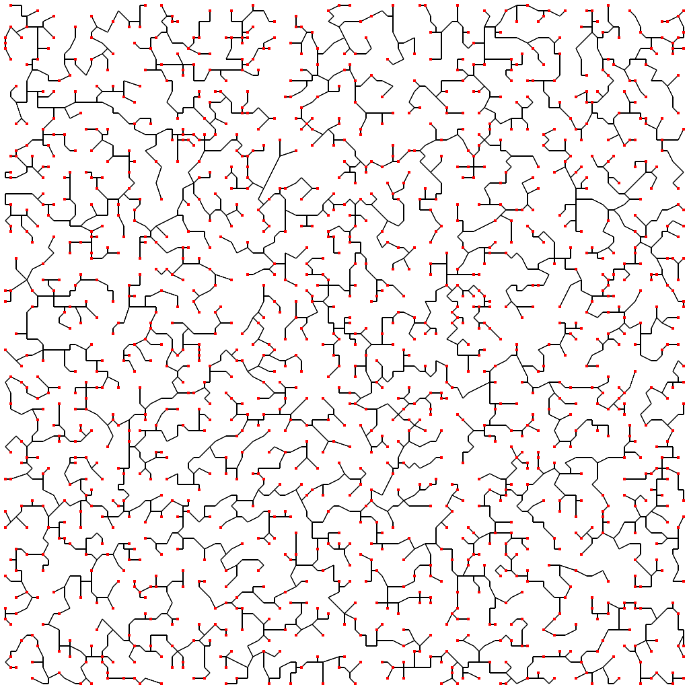
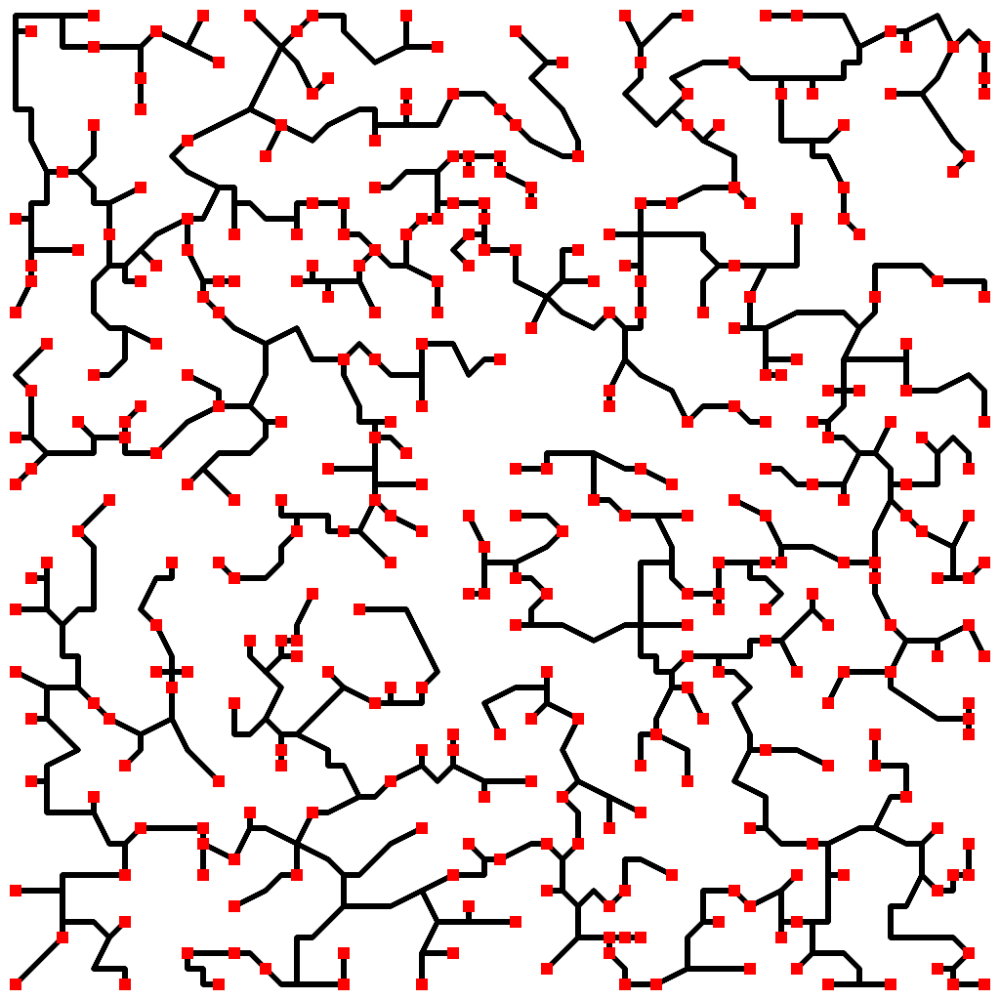

# Prim's Dungeon

An implementation of Prim's minimum-spanning-tree algorithm to generate random dungeon systems.

## How does it work?

To simplify it slightly:

 1. Generate a grid spanning the entire image
 2. For each grid intersection, randomly either place a node there or don't (based on `nodeChance`)
 3. Create a complete graph (that is, a graph where every node is connected directly to every other node), encoding this in a distance matrix
 4. Run Prim's minimum-spanning-tree algorithm over this (I'm not explaining it, look it up on Wikipedia)
 5. Render the resulting adjacency matrix to a `.png`
   - For each node, the probability is calculated by _e ^ cn_ where _c_ is `roomProbabilityCoefficient` and _n_ is the number of edges incident to that node

## Features:

 - Parallelised just about as much as possible. Uses as many cores as you can throw at it, so it's perfect if you have a supercomputer or two lying around.
 - Fully customizable
   - Change any of the arbitrary variables at the top of `main.go` to alter the behaviour:
     - `width`, the width of the output image
     - `height`, the height of the output image
     - `gridSpacing`, the distance between nodes on the grid
     - `roadWidth`, the width of roads between rooms
     - `roomRadius`, the radius of each room
     - `roomRadiusVariance`, how much the room radius is allowed to randomly change
     - `nodeChance`, the chance of placing a node on a grid intersection
     - `roomProbabilityCoefficient`, _c_ in _P(room) = e ^ cn_ where _n_ is the number of edges connected and _P(room)_ is the probability that a room should be placed on a node
     - `roadColour`, the colour of roads between rooms
     - `roomColour`, the colour of rooms
     - `threadCount`, the number of threads which will be made to process the MST
 - Takes an absolute eternity to generate minimum spanning trees.
   - This is due to the nature of Prim's algorithm. It will run really fast towards the beginning of the program, and towards the end, but extremely slowly in the middle. If you want to know why, think about Prim's algorithm and how it works and I'm sure you'll figure it out.
